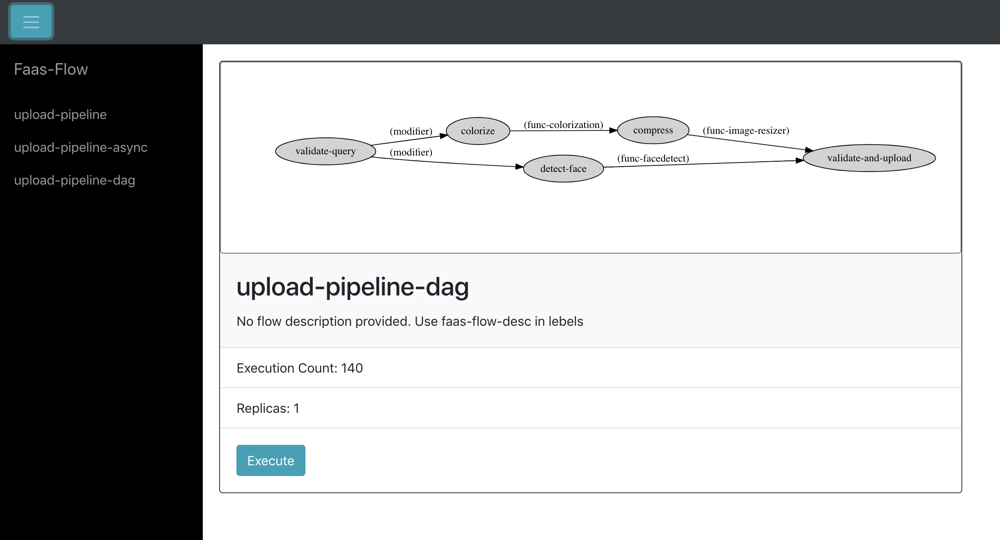
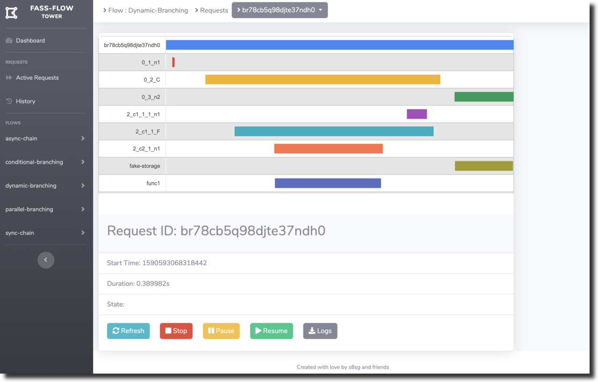

# faas-flow-tower
A monitoring function stack to visualize faas-flow functions and requests in realtime
    
Dashboard provide details for each faas-flow functions incuding graphical representation of dags based on function definition
   

Tower provides realtime timeline for requests for individual nodes of each faas-flow functions
    
   

### Getting Started
FaaS-Flow Tower comes with the default `StateStore`, `DataStore` and `EventManager` for your flow functions. 

 |Item|Implementation|Swarm URL|Kubernets URL|
 |---|---|---|---|
 |StateStore|[Consul StateStore](https://github.com/s8sg/faas-flow-consul-statestore)|`consul:8500`|`consul.openfaas:8500`|
 |DataStore|[Minio DataStore](https://github.com/s8sg/faas-flow-minio-datastore)|`minio:9000`|`minio.openfaas:9000`|
 |EventManager|[Jaguar](https://github.com/jaegertracing/jaeger)|`jaegertracing:16686`|`jaegertracing.openfaas:16686`|

### Deploy OpenFaaS
FaasFlow Tower requires the OpenFaaS to be deployed and the OpenFaaS Cli. You can either have your OpenFaaS deployed in Kubernets otherwise in Swarm. To deploy OpenFaaS and to install the OpenFaaS cli client follow this guide: https://docs.openfaas.com/deployment/      

> Note: If you have deployed your OpenFaaS in Kubenets, it is recomanded to deploy FaaSFlow Tower services in same environment to simplify configuration


### Deploy in Swarm 

#### Pre-reqs:
To deploy in swarm docker swarm need to installed and the targeted node need to have swarm cluster initialized. To initialize a swarm cluster follow this guide: https://docs.docker.com/engine/swarm/swarm-mode/.     

#### Clone the Repo
```sh
git clone https://github.com/s8sg/faas-flow-tower
cd faas-flow-tower
```

#### Set OpenFaaS Gateway
Update the `stack.yml` with your OpenFaaS gateway's URL
```yaml
provider:
  name: faas
  gateway: http://127.0.0.1:8080
```

#### Set Configuration
Configuration are defined in `conf.yml`. Based on your deployment you may need to update the configuration before you use the deployment script.   
```yaml
environment:
  gateway_url: "http://gateway:8080/"
  # gateway_public_uri: "http://localhost:8080"
  basic_auth: true
  secret_mount_path: "/var/openfaas/secrets"
  trace_url: "http://jaegertracing:16686/"
```
##### Gateway URL    
Change the `gateway_url` into `http://gateway:8080` 
     
##### Trace URL     
Set the trace url ('trace_url') to `http://jaegertracing:16686/` 

#### Deploy with the script
```sh
./deploy.sh
```
This script will deploy the OpenFaaS functions in the OpenFaaS and the other services in Swarm
   
  
    
### Deploy in Kubernets
For deploying in kubernets Faas-Flow Tower uses helm charts for the defaults    

#### Pre-reqs:
##### Install the helm CLI/client

Instructions for latest Helm install

* On Linux and Mac/Darwin:
```sh
curl "https://raw.githubusercontent.com/kubernetes/helm/master/scripts/get" | bash
```
* Or via Homebrew on Mac:
```sh
brew install kubernetes-helm
```
##### Install tiller

* Create RBAC permissions for tiller

```sh
kubectl -n kube-system create sa tiller \
  && kubectl create clusterrolebinding tiller \
  --clusterrole cluster-admin \
  --serviceaccount=kube-system:tiller
```

* Install the server-side Tiller component on your cluster

```sh
helm init --skip-refresh --upgrade --service-account tiller
```

> Note: this step installs a server component in your cluster. It can take anywhere between a few seconds to a few minutes to be installed properly. You should see tiller appear on: `kubectl get pods -n kube-system`.

#### Deploy minio (Default DataStore)
Minio is used as the default DataStore in FaaSFlow    
   
* Generate secrets for Minio
```sh
SECRET_KEY=$(head -c 12 /dev/urandom | shasum| cut -d' ' -f1)
ACCESS_KEY=$(head -c 12 /dev/urandom | shasum| cut -d' ' -f1)
```
* Store the secrets in Kubernetes
```sh
kubectl create secret generic -n openfaas-fn \
 s3-secret-key --from-literal s3-secret-key="$SECRET_KEY"
kubectl create secret generic -n openfaas-fn \
 s3-access-key --from-literal s3-access-key="$ACCESS_KEY"
```

* Install Minio with helm
```sh
helm install --name minio --namespace openfaas \
   --set accessKey=$ACCESS_KEY,secretKey=$SECRET_KEY \
   --set replicas=1,persistence.enabled=false,service.port=9000,service.type=NodePort \
  stable/minio
```

* The DNS address for minio will be `minio.openfaas:9000`

#### Deploy Consul (Default StateStore)
Consul is used as the default StateStore in FaaSFlow     
   
* Install Consul with helm
```sh
helm install --name consul --namespace openfaas stable/consul
```

* The DNS address for consul will be `consul.openfaas:8500`

#### Deploy Jaeger for Tracing
Jaeger is used as a tracing backend by the FaaSFlow 

* Install Jaeger with helm
```sh
helm install incubator/jaeger --name jaegertracing --namespace openfaas \
     --set cassandra.config.max_heap_size=1024M \
     --set cassandra.config.heap_new_size=256M --set cassandra.resources.requests.memory=2048Mi \
     --set cassandra.resources.requests.cpu=0.4 --set cassandra.resources.limits.memory=2048Mi \
     --set cassandra.resources.limits.cpu=0.4
```
   
* The DNS address for jaeger will be `jaegertracing.openfaas:16686`

#### Set OpenFaaS Gateway
Update the `stack.yml` with your OpenFaaS gateway's URL
```yaml
provider:
  name: faas
  gateway: http://127.0.0.1:8080
```

#### Set Configuration
Configuration are defined in `conf.yml`. Based on your deployment you may need to update the configuration before you use the deployment script.   
```yaml
environment:
  gateway_url: "http://openfaas.gateway:8080/" 
  # gateway_public_uri: "http://localhost:8080"
  basic_auth: true
  secret_mount_path: "/var/openfaas/secrets"
  trace_url: "http://openfaas.jaegertracing:16686/" 
```

##### Gateway URL    
Change the `gateway_url` into `http://openfaas.gateway:8080/` 
     
##### Trace URL     
Set the trace url ('trace_url') to `http://openfaas.jaegertracing:16686/` 

#### Deploy Functions
Deploy the OpenFaaS functions in the OpenFaaS 
```sh
faas deploy
```

### Access the Dashboard
Once deployed the dashboard will be available as a openfaas function at: [localhost:8080/function/faas-flow-dashboard](localhost:8080/function/faas-flow-dashboard)     
Change the `localhost:8080` to your openfaas Gateway URL    

#### Make your flow visible 
To make flow functions visible in the dashboard add `faas-flow : 1` label in `stack.yml` of each flow functions  
```
annotations:
   faas-flow-desc: "option labels to provide flow descriptions"
labels:
   faas-flow : 1
``` 
   
#### Monitoring
Faasflow fetches the monitoring information from jaeger trace server. To enable tracing for flow function add environment `enable_tracing: true` and set trace server url `trace_server: "jaegertracing:5775"` in `stack.yml`. For kubernets use `trace_server: "jaegertracing.openfaas:5775"`
