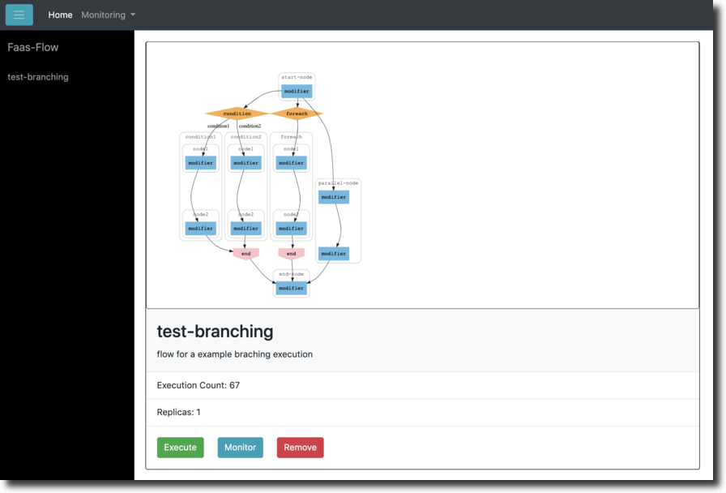

# faas-flow-tower

A monitoring stack for [faas-flow](https://github.com/s8sg/faas-flow) with greater visibity of flows  



Dashboard provide details for each faas-flow functions incuding graphical 
representation of dags based on function definition  


Request can be monitored realtime with timeline for requests for individual 
nodes of each faas-flow functions  


## Deploy OpenFaaS

FaasFlow Tower requires the OpenFaaS to be deployed and the OpenFaaS Cli. You
can either have your OpenFaaS deployed in [Kubernets](https://kubernetes.io) or
in [Swarm](https://docs.docker.com/engine/swarm/).

To deploy OpenFaaS and to
install the OpenFaaS cli client follow this guide:
[https://docs.openfaas.com/deployment/](https://docs.openfaas.com/deployment/).

> Note: If you have deployed your OpenFaaS in Kubenetes, it is recommended to
> deploy FaaSFlow Tower services in same environment to simplify configuration

## Deploy Faas-flow Components with Faas-flow Infra

[Faas-Flow infra](https://github.com/s8sg/faas-flow-infra) provides the
kubernetes and swarm deployment resources for faas-flow dependencies.

## Deploy Faas-flow Tower

### Configure

Configurations are defined in [conf.yml](conf.yml). Based on your deployment you
may need to update the configuration before you use the deployment script.

### Deploy Functions

Deploy the OpenFaaS functions in OpenFaaS:

```sh
faas deploy -g localhost:31112
```

You might have to change the `localhost:31112` to your openfaas Gateway URL.

## Access the Dashboard

Once deployed the dashboard will be available as a openfaas function at
[localhost:31112/function/faas-flow-dashboard](localhost:31112/function/faas-flow-dashboard).   
    
Change the `localhost:31112` to your openfaas Gateway URL.

## Make your flow visible

To make flow functions visible in the dashboard add `faas-flow : 1` label in
`stack.yml` of each flow functions.

```yaml
annotations:
   faas-flow-desc: "option labels to provide flow descriptions"
labels:
   faas-flow : 1
```

## Monitoring

Faasflow fetches the monitoring information from jaeger trace server. To enable
tracing for flow function add environment, set     
```yaml
enable_tracing: true        
trace_server: "jaeger-agent.openfaas:5775"
```

